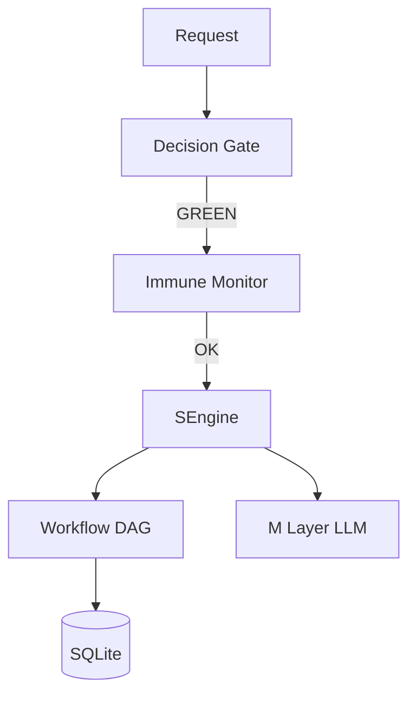

# metaos — Architecture

> **Layer**: L2 引擎面  
> **Role**: 编排引擎 — 决策门控 / 免疫监控 / 路由 / 工作流  
> **Stack**: Python 3.13+, uv, fastmcp, structlog  
> **Health**: 189 tests, 100% pass
>
> 系统全景参见：[`docs/ARCHITECTURE-DIAGRAM.md`](../docs/ARCHITECTURE-DIAGRAM.md)

---

## 1. 内部架构



## 2. 入口

| Type | Entry | Port / Notes |
|:--|:--|:--|
| CLI | `metaos` | 14 子命令 + REPL |
| MCP stdio | `python -m metaos.mcp_server` | 11 tools |
| Dashboard | `metaos dashboard` |  |

## 3. 核心模块

| Module | Responsibility |
|:--|:--|
| `src/metaos/core/engine.py` | SEngine six-step orchestration |
| `src/metaos/core/gate.py` | Decision gate GREEN/YELLOW/RED |
| `src/metaos/core/immune.py` | Immune monitor WARNING/FREEZE/MELTDOWN |
| `src/metaos/core/workflow.py` | DAG workflow engine |
| `src/metaos/mcp_server.py` | MCP server |
| `src/metaos/layers/m_layer.py` | LLM adapter |

## 4. 测试

```bash
cd projects/metaos && uv run pytest tests/ -q
```
