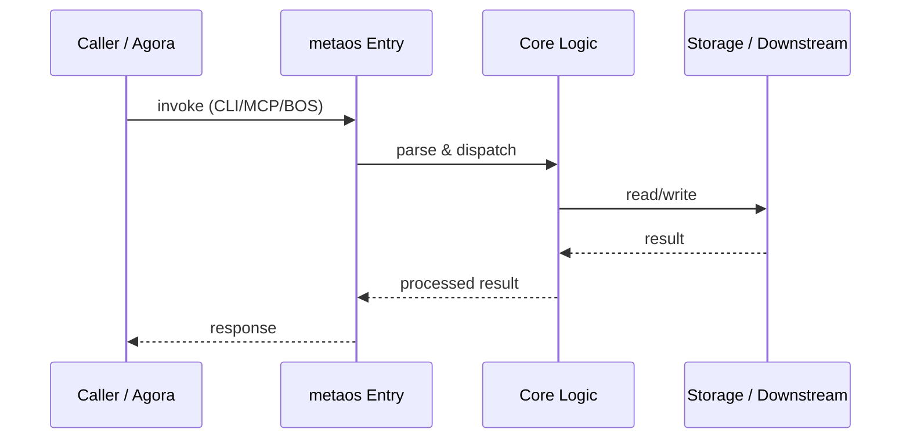

# metaos — Call Chain

> 本文档描述 metaos 内部最核心的一条调用链 / 数据流。
>
> 通用跨层调用链参见：[`../../docs/I0-AGORA-CALLCHAIN.md`](../../docs/I0-AGORA-CALLCHAIN.md)

---

## 关键路径

1. 1. Incoming request hits `bos://governance/metaos/decide`
2. 2. `gate.py` evaluates decision matrix and returns GREEN/YELLOW/RED
3. 3. `immune.py` monitors anomaly level (WARNING/FREEZE/MELTDOWN)
4. 4. `engine.py` runs six-step orchestration if gate passes
5. 5. `workflow.py` executes DAG plan, persists to SQLite
6. 6. Result returned via MCP/stdio

## Sequence Diagram

